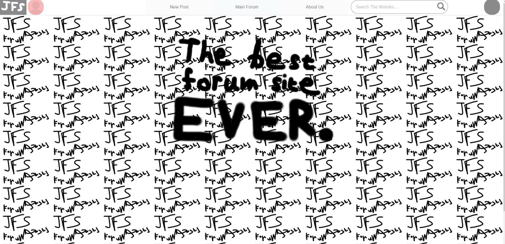
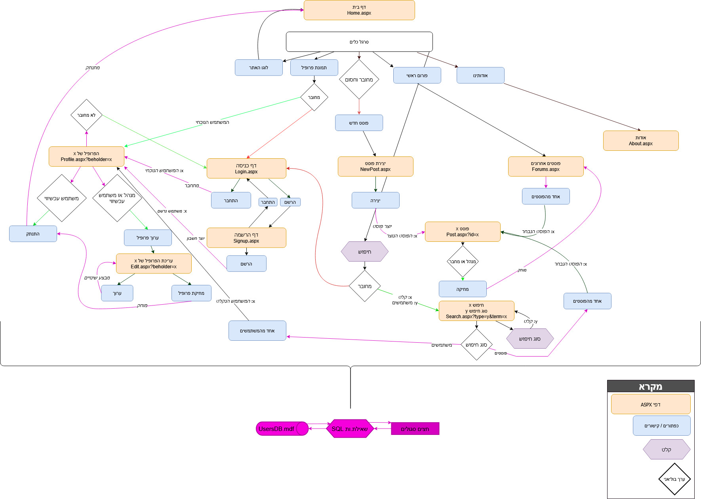
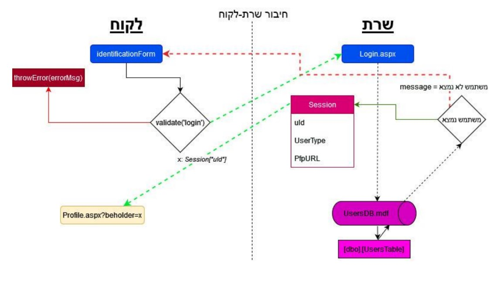
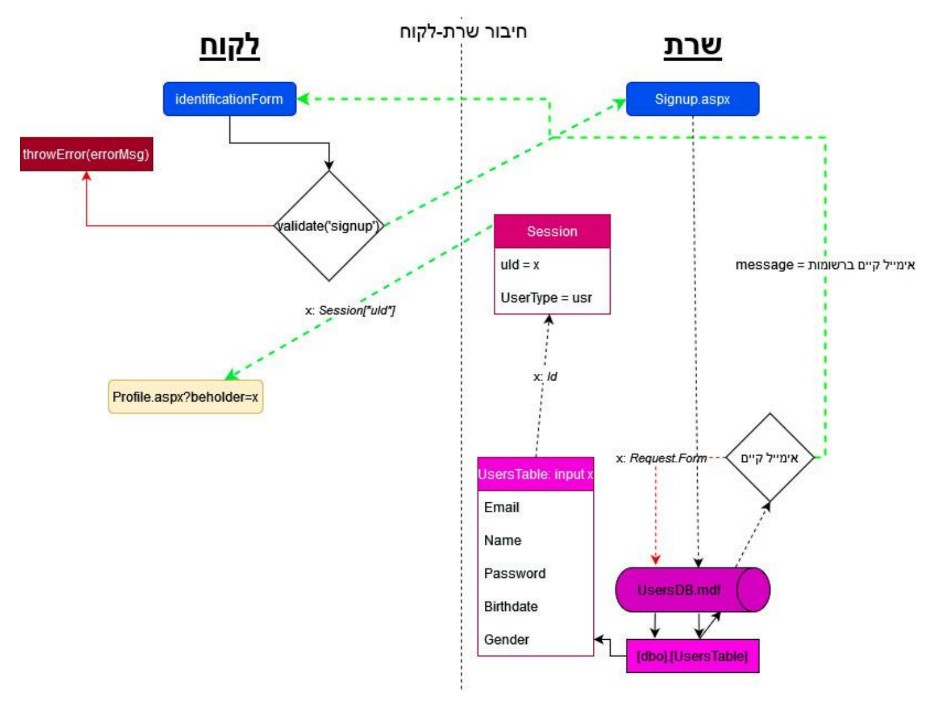

# JFS — the Juicy Forum Site

This ASP.NET website was submitted as part of my project for the 10th-grade Bagrut of Computer Science back in the summer of '22.

*(Though it was made and submitted in 8th grade 'cuz I'm just that cool 😎)*

The project was finished in the span of about 2 months.

The theme of the site was centered around **Public Feedbackless Journalism**.

Below are the details as submitted to the Magen examination.

## Purpose of Webite

The site is designed for sharing stories and stuff in general, in an accessible and fast way - specifically in an article style.

Unlike other forum sites, it does not support any sort of user feedback—be it comments, reactions, or statistics of any kind.  
This should provide creators with the freedom of expression, and those who are afraid of one's commentary: the peace of mind.

The website is designed to resemble a generic forum site, allowing users to upload any story they want - without the fear of criticism.

## Target Audience
This website is intended for those interested in articles and journalism, but not reviews, by allowing the publication of various articles to all site visitors.

## Description of Website

The site allows the user to upload and view articles, and edit their user as they wish.

There are four levels of permission for site users:

1. **Blocked user**: A user with this role is allowed to design their profile as they wish, search
and view various articles throughout the site; but is not able to create them themselves.

2. **Guest** *(not logged in/registered)*: A user with this role can view the latest articles created by users registered on the site, but cannot freely search for them; but is not able to create them themselves.

3. **Registered user**: A user with this role is able to browse the site freely; create articles, search the site and design their own profile. They can also delete articles created by them.

4. **Administrator & Creator**: A user with any of these roles is granted all the permissions of a regular, registered user, but is also granted the ability to modify and delete other user's posts and profiles as they wish.

Registration and login are carried out through the registration form located in the profile picture on the navigation bar of all pages.

When registering, the user must enter an email, name, username (optional), date of birth, gender and password.

When logging in, the user must enter the email and password with which they registered.

## Development Environment

- Languages: *JavaScript, HTML, and the ASP.NET Framework*.
- IDE and Environment: *Visual Studio 2020* under the notorious *Windows 10* ( no Linux support :[ )
> Note that I actually write that in as-is lmaaoooo  
> Also I did not know about C-Lion nor would have I had my parent's financial approval and support for it

- Database provider: Microsoft SQL Server

## Operating the Website

- To log in as a blocked user (*Ehe Tenandayo*), enter the following login information:
	- **EMAIL**: `lol@um.what`
	- **PASSWORD**: `Lol123`
- To log in as a regular user (*Normie123*), enter the following login information:
	- **EMAIL**: `spammer@mail.ru`
	- **PASSWORD**: `spammer123`
- To log in as an administrator (*Administrator*), enter the following login information:
	- **EMAIL**: `admin@jfs.co.il`
	- **PASSWORD**: `admin`
- To log in as an creator (*StavWasPlayZ*), enter the following login information:
	- **EMAIL**: `mypersonalemailaddrredacted@forabvious.reasons`
	- **PASSWORD**: `ThisPasswordIsNotEncrypted1`

## Website Operation

> [!NOTE]
> Do forgive the Hebrew, 'bit too much to translate. :P

### User Interface + Website Map

### Login Query

### Signup Query

*The rest of the Magen contains some more useless biolerplate information, not to be attached here.*